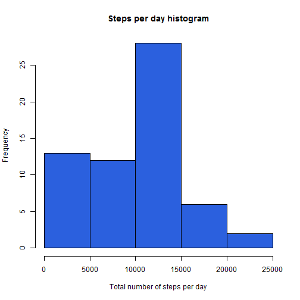
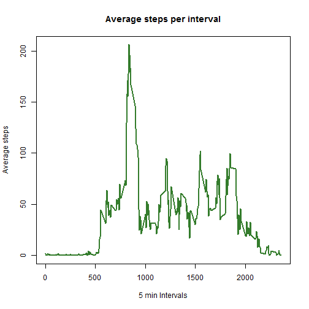
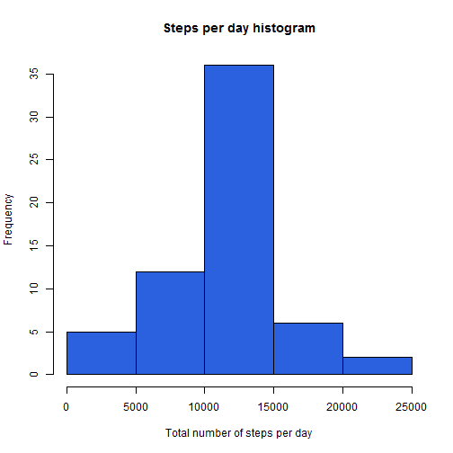
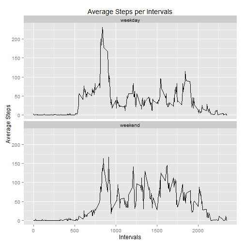

Reproducible Research - Peer Assignment 1
===================================================

### Loading and preprocessing the data


```r
activityData <- read.csv("activity.csv", , sep=",", header=TRUE, stringsAsFactors = FALSE)
activityData$date <- as.Date(activityData$date, format = "%Y-%m-%d")
```

### What is mean total number of steps taken per day?
#### 1. Calculate the total number of steps taken per day 

Grouping the data by "date"  using the dplyr package and summarising the sum of steps per day excluding the missing values in the dataset. The summarised data is stored in the "stepsByDay" data frame.


```r
library(dplyr)
stepsByDay <- 
    activityData %>%
    group_by(date) %>%
    summarise (sumSteps = sum(steps, na.rm = TRUE))
```
#### 2. Make a histogram of the total number of steps taken each day

```r
hist(stepsByDay$sumSteps, xlab = "Total number of steps per day", main = "Steps per day histogram", col = "#2B60DE")
```

 

#### 3. Calculate and report the mean and median of the total number of steps taken per day


```r
mean(stepsByDay$sumSteps, na.rm = TRUE)
```

```
## [1] 9354.23
```

```r
median(stepsByDay$sumSteps, na.rm = TRUE)
```

```
## [1] 10395
```
### What is the average daily activity pattern?
#### 1.Make a time series plot (i.e. type = "l") of the 5-minute interval (x-axis) and the average number of steps taken, averaged across all days (y-axis)

Grouping the data by "interval" and calculating the step means for each 5 min interval again excluding the missing data. The summarised data is stored in the "avgStepsPerInt" data frame.


```r
avgStepsPerInt <- 
    activityData %>%
    group_by(interval) %>%
    summarise(meanSteps = mean(steps, na.rm = TRUE))
```

Creating a plot of the mean intervals


```r
plot(avgStepsPerInt$interval,avgStepsPerInt$meanSteps, type = "l", col = "#347C2C", lwd = "2", xlab = "5 min Intervals", ylab = "Average steps", main = "Average steps per interval")
```

 

#### 2. Which 5-minute interval, on average across all the days in the dataset, contains the maximum number of steps?


```r
maxVal <- avgStepsPerInt$interval[avgStepsPerInt$meanSteps == max(avgStepsPerInt$meanSteps)]
```

The 5 minute interval that contains maximum number of steps is 835

### Imputing missing values

#### 1.Calculate and report the total number of missing values in the dataset (i.e. the total number of rows with NAs)


```r
sum(!complete.cases(activityData))
```

```
## [1] 2304
```
#### 2.Devise a strategy for filling in all of the missing values in the dataset. The strategy does not need to be sophisticated. For example, you could use the mean/median for that day, or the mean for that 5-minute interval, etc.

My strategy is to update the missing value steps in the original dataset with the 5-minute interval means accross all days. We already have these calculated in the "avgStepsPerInt" data frame. The 5 min interval means give us detailed picture about the steps done over the 2 months. 

#### 3.Create a new dataset that is equal to the original dataset but with the missing data filled in.

Using the inner_join function from the dplyr package will combine the two datasets (the original one - activityData and the avgStepsPerInt) into one "updatedData" dataset. Then with the mutate function will replace all NA values from the "steps" column with the corresponding 5 min Interval means for this 5 min Interval. The new values are stored in "stepsNew" column.  As a last step will drop the original "steps" column along with "stepsMean" column and will rename the "stepsNew" column to "steps" to keep the original data frame format.


```r
updatedData <- inner_join(activityData,avgStepsPerInt)
```

```
## Joining by: "interval"
```

```r
updatedData <- mutate(updatedData, stepsNew=ifelse((is.na(steps)), meanSteps, steps))
updatedData <- select(updatedData, 2:3,5)
colnames(updatedData)[3] <- "steps"
```
#### 4.Make a histogram of the total number of steps taken each day and Calculate and report the mean and median total number of steps taken per day. Do these values differ from the estimates from the first part of the assignment? What is the impact of imputing missing data on the estimates of the total daily number of steps?

Calculating the total number of steps taken each day based on the "UpdatedData" data frame and creating a histogram:


```r
stepsByDay2 <- 
    updatedData %>%
    group_by(date) %>%
    summarise (sumSteps = sum(steps, na.rm = TRUE))

hist(stepsByDay2$sumSteps, xlab = "Total number of steps per day", main = "Steps per day histogram", col = "#2B60DE")
```

 

Calculating the mean and meadian


```r
mean(stepsByDay2$sumSteps)
```

```
## [1] 10766.19
```

```r
median(stepsByDay2$sumSteps)
```

```
## [1] 10766.19
```

Both mean and median have increased after replacing the NA values with the average 5 min interval steps. The difference is more significant for the meam value. 

### Are there differences in activity patterns between weekdays and weekends?

#### 1.Create a new factor variable in the dataset with two levels - "weekday" and "weekend" indicating whether a given date is a weekday or weekend day.

Again using the mutate function we will create a new variable that takes two values "weekend" and "weekday", depending on day.The result data is stored in the weekData data frame.


```r
varWeekends <- c("Saturday", "Sunday")

weekData <- updatedData %>%
    mutate(day = ifelse((weekdays(date) %in% varWeekends), "weekend", "weekday"))
```

#### 2.Make a panel plot containing a time series plot (i.e. type = "l") of the 5-minute interval (x-axis) and the average number of steps taken, averaged across all weekday days or weekend days (y-axis). 

Grouping the "weekData" data frame by interval and day and calculating the mean steps. Creating a plot using ggplot2 plotting system.


```r
AvgStepsData <- weekData %>%
    group_by(interval, day) %>%
    summarise(meanSteps = mean(steps))

library(ggplot2)
library(grid)
qplot(interval, meanSteps, data = AvgStepsData, facets = .~day, geom="path", xlab="Intervals", ylab="Average Steps", main="Average Steps per Intervals") + facet_wrap(~day, nrow=2, ncol=1)
```

 
